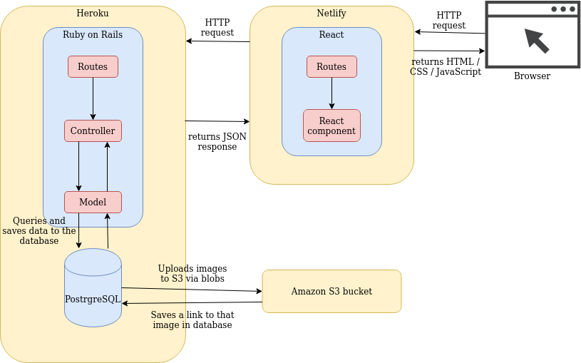
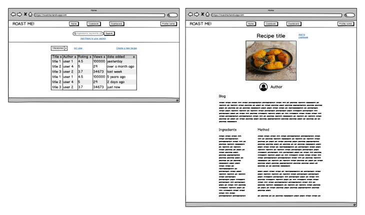

# Roastme!

A social cookbook. Perhaps a social library of social cookbooks.

Users can create a recipe using an intuitive tool set, refine it as it evolves, and ultimately publish and share it in an attractive blog format designed for sharing on your favourite social media platforms.

The ultimate goal is a sort of github for recipes. Each recipe maintains a complete history of every change made, and which user made that change. Users can "fork 🍴" a recipe and it becomes theirs, free to modify as they please.

## Purpose

Cuisine is arguably the only thing all the myriad cultures and creeds in this world can agree on and bond over.

Recipes have deep roots in culture, as reflected in the huge swaths of text one finds when they look up any recipe ("skip to ingredients" please).

Probably because of this, the best dishes don't have well-defined recipes with uniform or even repeatable measures for what needs to go on or in them. Many include whimsical measures like drams, handfuls or cups.

Initially Roastme will simply define recipes in text, however under the hood there will be room to get all of this into grams, taking into account the densities of different ingredients that would otherwise be measured by volume.

We are [actively][1] [researching][2] [ways][3] users might want to interact with online recipes, and as a stretch goal we are looking into IoT integration - recipes are stored as structured data so connecting our api to other frontends is just a matter of correct formatting.

[1]: https://developers.google.com/search/docs/data-types/recipe
[2]: https://api2.bigoven.com/web/documentation/recipes
[3]: https://www.amazon.com.au/newscorp-Taste-com-au/dp/B0778JD3H2

## Functionality / features

### MVP features

- Mobile first
- Faves - like recipe bookmarks
- Image uploading / Amazon S3
- Heroku / Netlify deployment
- User rating
- Search / filtering / sorting
- Unit conversion (internally all grams)
- Scale by number of servings
- Comments threads on recipes

### Aspirational features

- Track recipe history
- "Clone" recipes, conceptually similar to git
- Data captured on unique views
- Trends
- Recommended recipes

## Target audience

Any home cook who is looking for new and exciting recipes, or looking for a springboard to develop their own unique takes on them.  
A particular focus on food bloggers, instagrammers and even food businesses looking to promote themselves through social media.

## Tech stack

Ruby on Rails  
Javascript - React  
HTML/CSS  
Amazon S3  
Heroku  
Netlify

## Dataflow diagram

## Application Architecture Diagram

## User stories

### Steve the blogger
Steve wants to blog about his cooking adventures, with an eye to becoming a geniune instagram influencer. he would honestly just like a way to turn his recipe process into a blog post with pics and everything else and publish the whole thing, so ideally he'd have a tool that both guides him through the process and is able to output a sort of public view of it that includes his ramblings about travelling in tuscany, and how his nonna used to cook, etc etc. if his recipe tracker can do this he's be overjoyed.

### Lucy the food explorer
Lucy wants to develop her own take on a recipe she had at a restaurant. there's scant info online and most of it is people with no idea. she embarks on an iterative process of juggling different amounts of different things, scribbling notes down etc.
in the end after several attempts she has something that works, but it's a long list on the back of an envelope in arbitrary units. to lock it down she re-makes the recipe one more time, weighing each ingredient carefully. the recipe app should give access to the whole process here, allowing pics of various steps etc, and presenting the current iteration in a form where it can be re-made at any scale by just multiplying everything.

### Jarvis the 9 year old cheflet
Jarvis likes to cook, but he's 9 years old. he forgets to write anything down and is frustrated when he wants to make something again that he loved. he needs a way to get it all down easily and read it all back in a way that is simple enough for a 9yo

### Adrian the clueless but well-meaning
Adrian can't remember recipes well. he needs an assistant that will tell him exactly what to do at every step or he will simply screw it up. this goes for ingredients and process alike. he likes foody stuff but is clueless and would honestly rather be coding or pontificating on twitter than going through the actual "cooking" part of cooking.

## Wireframes

  

## Trello management

